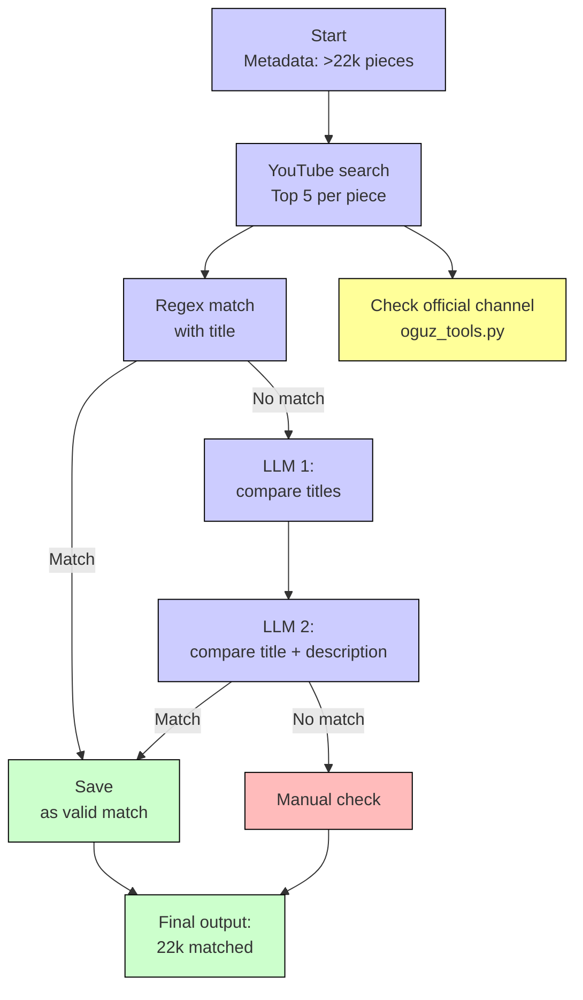

# YouTube Matching for \emph{MGPHot}

This folder contains code to collect YouTube URLs for the metadata of \emph{MGPHot}. The pipeline follows the process described in the paper.

## Overview

We start from metadata for 21,320 chart tracks. For each track, we search YouTube with the song title and the artist name, and we keep the top five results.  
A regular expression match between the track title and the video title gives a direct hit in \(72.91\%\) of the cases.  
When the match fails, we apply two large language model (LLM) passes with QWEN2.5\_32B~\cite{qwen2.5}: the first compares only titles and artist information, adding \(22.86\%\) matches; the second also checks video descriptions, leaving only 163 tracks for manual review.  
In parallel, we check whether each video is from an official artist channel, and \(56.43\%\) of the final matches are official uploads.  
This procedure matches all \emph{MGPHot} tracks with YouTube while keeping the share of unofficial sources low.

## Flowchart

## Contents of this folder

- Python scripts for:
  - running the YouTube search,
  - regex matching of titles,
  - two LLM passes,
  - optional manual review queue,
  - checking whether a channel is official (see `oguz_tools.py`).
- Minimal examples and instructions to rebuild the JSON artifacts locally.
- Checksums for reconstructed indices.

## Not included

- The intermediate and final JSON files with matches.  
  These files contain information derived from \emph{MGPHot}. The license of the original dataset does not allow redistribution of derivative files.  
  The scripts in this folder are enough to rebuild these JSON files.
