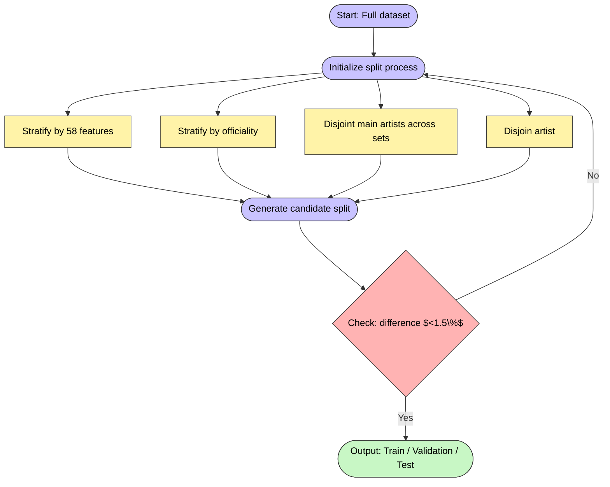

# Stratify

```bash
python statigy_with_year.py
```


```mermaid
flowchart TB
    start(["Start: Full dataset"]) --> init(["Initialize split process"])
    init --> strat58["Stratify by 58 features"] & official["Stratify by officiality"] & disjointMain["Disjoint main artists across sets"] & disjoinArtist["Disjoin artist"]
    strat58 --> gen(["Generate candidate split"])
    official --> gen
    disjointMain --> gen
    disjoinArtist --> gen
    gen --> check{"Check: difference $&lt;1.5\%$"}
    check -- Yes --> out(["Output: Train / Validation / Test"])
    check -- No --> init

     start:::purple
     init:::purple
     strat58:::yellow
     official:::yellow
     disjointMain:::yellow
     disjoinArtist:::yellow
     gen:::purple
     check:::red
     out:::green
    classDef purple fill:#c9c3ff,stroke:#333,stroke-width:1px,color:#000
    classDef yellow fill:#fff3a8,stroke:#333,stroke-width:1px,color:#000
    classDef red fill:#ffb3b3,stroke:#333,stroke-width:1px,color:#000
    classDef green fill:#c8f7c5,stroke:#333,stroke-width:1px,color:#000
    classDef gray fill:#e0e0e0,stroke:#666,stroke-width:1px,color:#000,stroke-dasharray:3 3
```